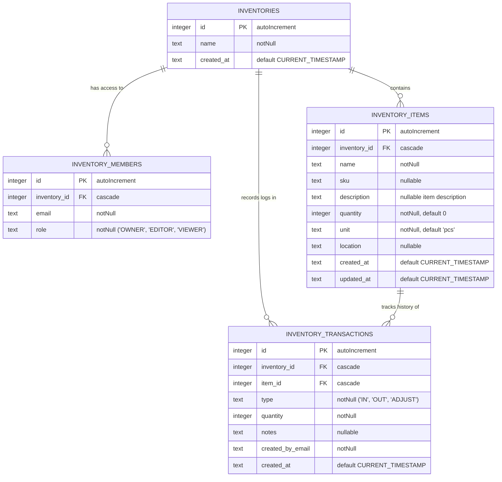

# Inventory

Fitur inventaris bersifat multi-tenant di dalam satu aplikasi. Satu user bisa punya akses ke banyak inventaris, dan satu inventaris bisa punya banyak anggota dengan peran berbeda.

## Prinsip Akses

- Permission global `inventory` dipakai untuk akses administratif inventaris, terutama membuat inventaris baru dan aksi global.
- Akses melihat inventaris spesifik tetap ditentukan oleh membership di tabel `inventory_members`.
- Superuser melewati semua pengecekan akses inventaris.
- User yang tidak punya membership inventaris dan tidak punya permission `inventory` tidak boleh membuka `/inventory`.
- Menu Inventaris di sidebar hanya muncul bila user punya permission `inventory`, punya membership pada setidaknya satu inventaris, atau adalah superuser.

## Struktur Data

Inventaris memakai tabel utama berikut di D1:

### Catatan Data

- Kolom deskripsi pada entitas inventaris sudah dihapus. Deskripsi yang masih ada hanya milik item inventaris.
- `inventory_members` memiliki unique constraint pada `(inventory_id, email)` agar satu email tidak punya membership ganda pada inventaris yang sama.
- Relasi foreign key memakai cascade delete, jadi penghapusan inventaris akan membersihkan data turunan secara otomatis.

## Rute

- `/inventory` menampilkan daftar inventaris yang bisa diakses user aktif.
- `/inventory/[id]` menampilkan halaman detail inventaris.

### Halaman Daftar

- Tombol buat inventaris hanya tampil untuk user dengan permission `inventory` atau superuser.
- Form create mengirim saat Enter ditekan.
- Daftar inventaris bisa difilter berdasarkan nama.
- Jika user tidak punya akses apa pun ke inventaris, halaman ini akan redirect ke dashboard dengan flash toast.

### Halaman Detail

- Judul inventaris bisa diubah langsung dari header.
- Anggota inventaris dikelola lewat dialog multi-select berbasis checkbox dan search.
- Riwayat stok dan item inventaris dikelola di halaman detail.
- Transfer stok antar inventaris tersedia dan item tujuan akan dibuat otomatis jika belum ada.
- Detail inventaris tidak menampilkan deskripsi tingkat inventaris karena field itu sudah dihapus.

## Server Actions Utama

File utama: [features/inventory/actions/inventory.ts](../features/inventory/actions/inventory.ts)

1. `assertInventoryGlobalAccess()` memastikan user sudah login.
2. `assertInventoryAccess(inventoryId, allowedRoles)` memvalidasi membership dan peran lokal.
3. `getInventories()` mengambil inventaris yang bisa diakses user.
4. `createInventory(name)` membuat inventaris baru dan mendaftarkan pembuat sebagai `OWNER`.
5. `updateInventoryName(inventoryId, name)` mengganti nama inventaris.
6. `deleteInventory(inventoryId)` menghapus inventaris beserta data turunannya.
7. `transferInventoryItem(sourceInventoryId, targetInventoryId, itemId, quantity)` memindahkan stok antar inventaris.
8. `addInventoryMember(...)`, `removeInventoryMember(...)`, dan `updateInventoryMemberRole(...)` mengelola anggota inventaris.

## Peran Lokal

- `OWNER`: hak penuh untuk mengubah inventaris, item, transaksi, dan anggota.
- `EDITOR`: bisa mengelola item dan transaksi stok.
- `VIEWER`: hanya baca.

## Pemeliharaan

- Jika menambah aksi inventaris baru, pastikan gate aksesnya eksplisit di server action.
- Jika menambah route inventaris baru, cek reserved slug di `lib/short-links.ts` dan dokumen route safety.
- Jika menambah kolom inventaris di database, sinkronkan schema, migrasi, dan docs di commit yang sama.
