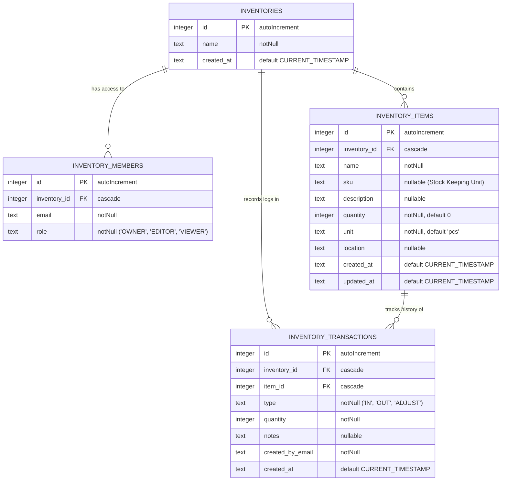

# Sistem Inventaris (Multi-Tenant & Multi-User)

Fitur Inventaris ini didesain khusus agar dapat menampung banyak daftar inventaris (multi-tenant) di dalam satu aplikasi, serta mendukung pembagian hak akses (multi-user) yang spesifik untuk setiap ruang inventaris.

---

## 1. Arsitektur Multi-Tenant & Multi-User

Sistem memisahkan tanggung jawab menjadi dua tingkatan utama:

### A. Izin Global (Aplikasi)

Diatur melalui Google Workspace custom schema (bisa diatur admin di menu `/access`):

- `inventory`: bukan syarat untuk melihat inventaris yang dibagikan. Di repo ini, izin global ini dipakai untuk akses administratif tingkat aplikasi, sedangkan akses ke inventaris spesifik ditentukan oleh membership di tabel `inventory_members`.
- `Superuser` (`proktor@smkdwiguna.sch.id`): Melewati (bypass) semua pengecekan izin dan bertindak sebagai administrator global untuk seluruh ruang inventaris di dalam aplikasi.

### B. Peran Lokal Tenant (Per Inventaris)

Diatur di dalam tabel `inventory_members` untuk masing-masing ruang inventaris:

- **OWNER**: Pemilik ruang inventaris tersebut. Memiliki hak akses penuh untuk menambah/mengubah/menghapus barang, mencatat transaksi stok, serta menambah/mengubah peran/menghapus anggota akses lainnya di ruang tersebut.
- **EDITOR**: Pengelola / Staff. Memiliki akses untuk melihat barang, menambah barang, mengubah informasi barang, serta mencatat transaksi mutasi stok masuk (IN) dan keluar (OUT).
- **VIEWER**: Pembaca / Tamu. Hanya dapat melihat daftar barang, ketersediaan stok, dan riwayat transaksi stok tanpa bisa memodifikasinya.

---

## 2. Struktur Tabel Database (Drizzle & D1)

Sistem menggunakan empat tabel terintegrasi di SQLite Cloudflare D1:

### Keamanan Unik & Integritas:

- Tabel `inventory_members` memiliki kekangan `unique` gabungan pada pasangan `(inventory_id, email)` untuk menghindari duplikasi status keanggotaan.
- Seluruh relasi kunci asing menggunakan opsi `onDelete: "cascade"`, sehingga jika suatu ruang inventaris dihapus oleh OWNER/Admin, semua data barang, keanggotaan, dan transaksi log yang terkait akan terhapus bersih dari database secara otomatis.

---

## 3. Rute & Navigasi (Next.js App Router)

Modul inventaris terintegrasi pada segmen route berikut:

- **`/inventory`** (Halaman Utama / List Dashboard): Menampilkan semua ruang inventaris yang dapat diakses oleh user aktif. Pembuatan ruang inventaris baru juga diinisiasi di sini.
- **`/inventory/[id]`** (Halaman Detail): Memuat data inventaris yang dipilih menggunakan layout tab dinamis:
  - **Tab Barang**: Menampilkan daftar barang, filter stok rendah, penambahan/pengubahan barang, dan fitur mutasi stok.
  - **Tab Akses Anggota**: Mengelola pembagian hak akses ke akun email google workspace lain.
  - **Tab Riwayat Stok**: Log transaksi audit stok barang masuk/keluar untuk keperluan audit berkala.

> [!IMPORTANT]
> Route `/inventory` telah didaftarkan dalam `SHORT_LINK_RESERVED_SEGMENTS` di `lib/short-links.ts` untuk mencegah bentrokan atau pembajakan route oleh tautan dinamis yang dibuat pengguna.

---

## 4. Server Actions Utama (`features/inventory/actions/inventory.ts`)

Aksi server (Server Actions) dirancang dengan proteksi otorisasi bertingkat:

1. **`assertInventoryGlobalAccess()`**: Menjamin pengguna telah login.
2. **`assertInventoryAccess(inventoryId, allowedRoles)`**: Memvalidasi apakah pengguna memiliki hak akses lokal di dalam tenant inventaris yang dituju dan perannya masuk dalam kriteria `allowedRoles`.
3. **`getInventories()`**: Mengambil data inventaris. Admin global dapat melihat _semua_ inventaris, sedangkan pengguna biasa hanya dapat melihat daftar inventaris tempat email mereka terdaftar di `inventory_members`.
4. **`createInventory(name)`**: Membuat grup baru dan langsung mendaftarkan pembuat sebagai `OWNER`.
   - Aksi ini hanya mensyaratkan login workspace, bukan permission global tambahan.
5. **`updateInventoryName(inventoryId, name)`**: Mengubah nama inventaris dari header halaman detail, untuk OWNER atau superuser.
6. **`transferInventoryItem(sourceInventoryId, targetInventoryId, itemId, quantity)`**: Memindahkan stok antar-inventaris; stok keluar dicatat di sumber, stok masuk dicatat di tujuan, dan item tujuan dibuat otomatis bila belum ada.
7. **`createStockTransaction(inventoryId, itemId, payload)`**: Menangani penambahan/pengurangan kuantitas stok barang, memperbarui total jumlah barang di `inventory_items`, dan menyisipkan catatan mutasi stok di `inventory_transactions` untuk tujuan penelusuran (audit trail).

---

## 5. Pemeliharaan & Pengembangan Selanjutnya

Jika ingin mengembangkan fitur ini lebih lanjut (seperti ekspor laporan PDF/Excel atau unggah massal barang):

1. Selalu lakukan pengecekan otorisasi menggunakan helper `assertInventoryAccess(inventoryId, ["OWNER", "EDITOR"])` di server actions baru Anda.
2. Pastikan file migrasi SQL baru dihasilkan secara konsisten menggunakan `npx drizzle-kit generate` dan diterapkan dengan `npx wrangler d1 migrations apply dwiguna-info --local` (tambahkan `CI=true` untuk mode non-interaktif).
